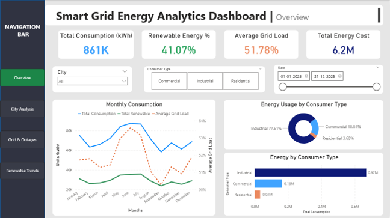
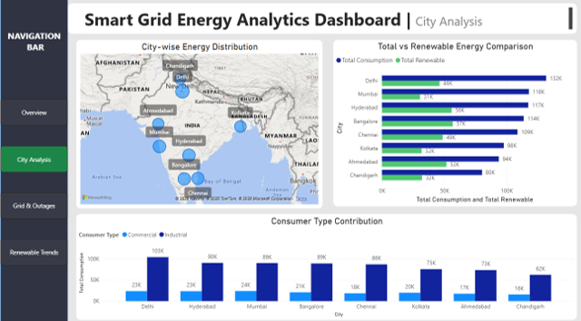
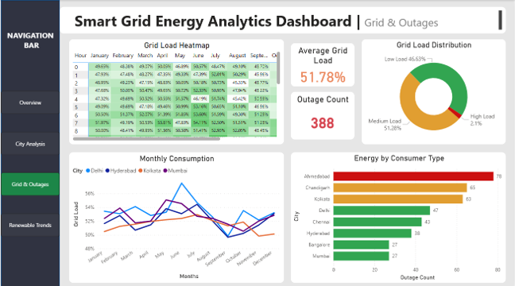
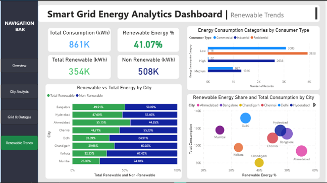

  # ⚡ Smart Grid Energy Analytics Dashboard
### A Power BI-Based Analytical Report on Smart Grid Energy Systems

> Transforming raw energy data into visual intelligence — consumption trends, grid stability, outage tracking, and renewable energy analysis across 8 major Indian cities.

---

## 🔗 Live Demo


> `https://app.powerbi.com/view?r=eyJrIjoiYjg2ODE3YzQtZjljNS00MWZmLTg0YTgtZjkyZDEzYzg5MTFjIiwidCI6ImQxZjE0MzQ4LWYxYjUtNGEwOS1hYzk5LTdlYmYyMTNjYmM4MSIsImMiOjEwfQ%3D%3D`

---

## 📸 Screenshots


| Overview | City Analysis |
|----------|---------------|
|  |  |

| Grid & Outages | Renewable Trends |
|----------------|-----------------|
|  |  |

---

## 📌 Overview

The **Smart Grid Energy Analytics Dashboard** is a multi-page interactive Power BI report.

The dashboard analyzes simulated smart meter data from **8 Indian cities** — Delhi, Mumbai, Hyderabad, Bangalore, Chennai, Kolkata, Ahmedabad, and Chandigarh - across **3 consumer segments** (Industrial, Commercial, Residential).

**Key numbers at a glance:**
- 🏙️ 8 cities analyzed
- ⚡ 861K kWh total energy consumption
- ♻️ 41.07% renewable energy share
- 📉 388 total recorded outages
- 📊 4 dashboard pages, 12+ chart types, 9 DAX measures

---

## ✨ Features

### 📋 Page 1 — Overview
- 4 headline KPI cards: Total Consumption, Renewable %, Average Grid Load, Total Energy Cost
- Monthly consumption multi-line chart (Total, Renewable, Grid Load on dual Y-axis)
- Energy breakdown by consumer type — donut chart + horizontal bar

### 🏙️ Page 2 — City Analysis
- Bubble map (Microsoft Bing Maps) with city-wise energy distribution
- Clustered bar chart: Total vs Renewable energy per city
- Consumer type contribution (Commercial vs Industrial) grouped by city

### ⚠️ Page 3 — Grid & Outages
- Grid load heatmap matrix (hour × month) with conditional formatting
- Multi-line chart: monthly grid load trends for 4 cities
- Grid load distribution donut (Low / Medium / High load bands)
- Outage count ranking by city — color-coded bar chart

### ♻️ Page 4 — Renewable Trends
- 100% stacked bar: renewable vs non-renewable split per city
- Scatter chart: Renewable % vs Total Consumption by city (bubble size = kWh)
- Energy consumption categories by consumer type

### 🔍 Cross-Page Features
- Persistent navigation bar for switching pages without losing filters
- City, Consumer Type, and Date Range slicers on Overview page

---

## 🛠 Tech Stack

| Layer | Technology |
|-------|------------|
| Dashboard & Visualization | Microsoft Power BI Desktop |
| Data Cleaning & Transformation | Power Query Editor |
| Calculated Measures & KPIs | DAX (Data Analysis Expressions) |
| Geographic Visualization | Microsoft Bing Maps |

---

## 📐 DAX Measures

```dax
Total Consumption = SUM(smart_grid_energy_dataset[Energy Consumption kWh])

Total Renewable = SUM(smart_grid_energy_dataset[Renewable Energy kWh])

Non-Renewable = [Total Consumption] - [Total Renewable]

Renewable % = DIVIDE([Total Renewable], [Total Consumption])

Average Grid Load = AVERAGE(smart_grid_energy_dataset[Grid Load Percentage]) / 100

Peak Consumption = CALCULATE([Total Consumption], smart_grid_energy_dataset[Peak Hour] = "Yes")

Outage Count = COUNTROWS(FILTER(smart_grid_energy_dataset, smart_grid_energy_dataset[Power Outage] = "1"))
```

---

## 🔧 Power Query Transformation Steps

1. **Change Data Types** — date → Date, kWh → Decimal, City/Consumer Type → Text
2. **Rename Columns** — standardized snake_case to readable names (e.g. tariff_rate → Tariff Rate)
3. **Remove Unused Columns** — dropped Temperature, Grid ID, City ID, Smart Meter ID, Voltage
4. **Add Energy Consumption Category** — conditional column: Low (<50 kWh) / Medium (<120 kWh) / High
5. **Add Grid Load Category** — conditional column: Low Load (<50%) / Medium Load (50–80%) / High Load (>80%)
6. **Reorder Columns** — improved readability for analysis
7. **Update Data Types for New Columns** — set both new columns to Text so Power BI treats them as categories
8. **Remove Redundant ID Columns** — final cleanup pass

---

## 📊 Key Findings

- **Industrial dominance** — Industrial consumers account for **77.51%** of total energy usage, making them the primary target for efficiency initiatives
- **Renewable gap** — 41.07% renewable share is significant, but over half the demand still comes from non-renewable sources
- **Grid stability** — Average grid load sits at **51.78%**; high-load events account for only **2.10%** of readings
- **Outage hotspots** — Ahmedabad leads with **78 outages**, followed by Chandigarh (65) and Kolkata (63) — priority cities for infrastructure investment
- **Delhi paradox** — Highest total consumption (**132K kWh**) but only **35% renewable** — highest potential for green energy growth
- **Bangalore & Ahmedabad** — Best renewable adoption at ~50–55% renewable share despite moderate total consumption

---

## 📁 Project Structure

```
smart-grid-dashboard/
├── smart_grid_energy_dataset.csv   # Synthetic dataset (generated via Python)
├── SmartGridDashboard.pbix         # Power BI report file
├── screenshots/
│   ├── overview.png
│   ├── city_analysis.png
│   ├── grid_outages.png
│   └── renewable.png
└── README.md
```

---

## 🚀 How to Open

1. Download and install Power BI Desktop (free)
2. Clone this repository:
   ```bash
   git clone https://github.com/Ayush2496/Smart-Grid-Energy-Analytics-Dashboard.git
   ```
3. Open `SmartGridDashboard.pbix` in Power BI Desktop
4. The dataset is embedded — no additional setup needed

---


